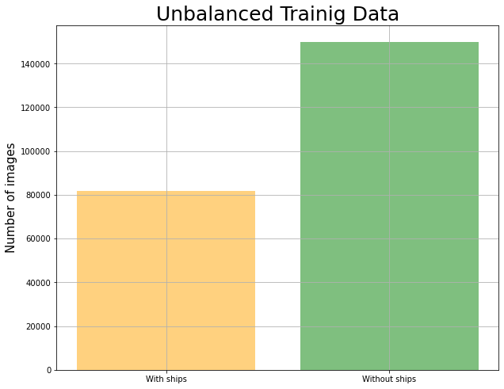
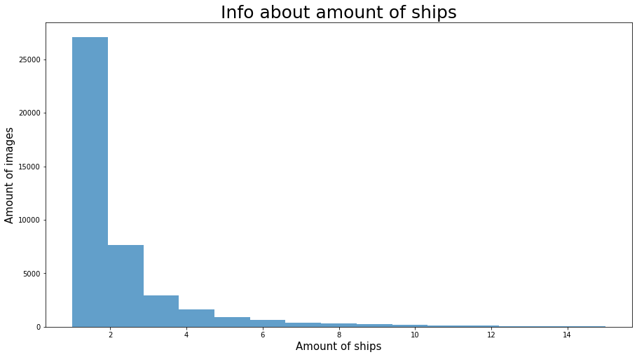
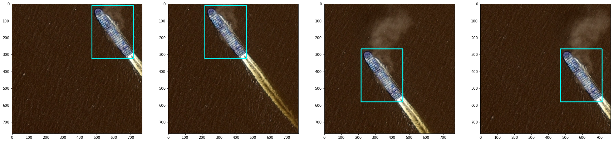
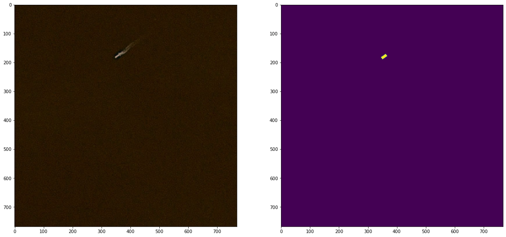
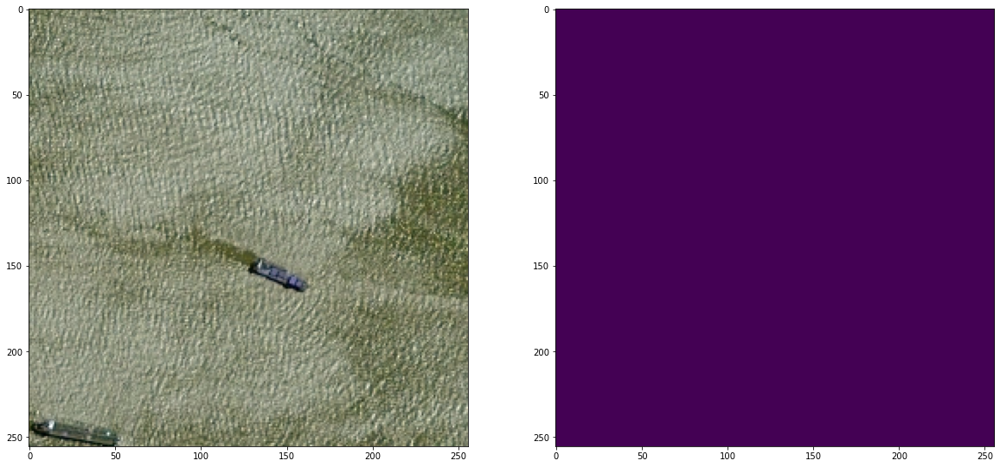

## Вступ

Технічним завданням є створення конвертаційної нейронної моделі, яка здатна сегментувати зображення. Прикладом зображення є знімки спутника, які були дропнуті на дрібніші фото для подальшої роботи. Метою моделі є сегментація кораблів на знімках. \
Для роботи я встановлюю тільки 2 файла - файл зі знімками для навчання та файл із масковою послідовністю. Надалі я поділю навчальний набір на три частини та провірю якість створеної моделі.

Гайда за роботу!

## Розвідувальний аналіз

Для початку імпортуємо усі бібліотеки необхідні для роботи:


```python
import os

from tqdm import tqdm

import numpy as np 
import pandas as pd 
import matplotlib.pyplot as plt

import cv2

from sklearn.model_selection import train_test_split

import tensorflow as tf
from tensorflow import keras
from keras.models import Model
from keras.layers import Input, Dense, Concatenate, GlobalAveragePooling2D, Dropout, UpSampling2D, Conv2D, MaxPooling2D, Activation

tf.compat.v1.logging.set_verbosity(tf.compat.v1.logging.ERROR)
```

Встановлюємо необхідну для роботи директорію.


```python
path = 'C:/Users/Vladislav/Desktop/Airbus'
path_to_train = 'C:/Users/Vladislav/Desktop/Airbus/train_v2'
os.chdir(path)
```


```python
print('Train file have {} images. \nShape of image is {}.'.format(len(os.listdir(path_to_train)), 
                                                                  cv2.imread(path_to_train + '/' + '00003e153.jpg').shape[:2]))
```

    Train file have 192556 images. 
    Shape of image is (768, 768).
    

Завантажуємо набір із масковою послідовністю та провіряємо його розмірність.


```python
df_segment = pd.read_csv('train_ship_segmentations_v2.csv')
df_segment.shape
```


    (231723, 2)


Дивимось його перших десять строк, щоб отримати розуміння про зовнішній вигляд.


```python
df_segment.head(10)
```


<div>
<style scoped>
    .dataframe tbody tr th:only-of-type {
        vertical-align: middle;
    }

    .dataframe tbody tr th {
        vertical-align: top;
    }

    .dataframe thead th {
        text-align: right;
    }
</style>
<table border="1" class="dataframe">
  <thead>
    <tr style="text-align: right;">
      <th></th>
      <th>ImageId</th>
      <th>EncodedPixels</th>
    </tr>
  </thead>
  <tbody>
    <tr>
      <th>0</th>
      <td>00003e153.jpg</td>
      <td>NaN</td>
    </tr>
    <tr>
      <th>1</th>
      <td>0001124c7.jpg</td>
      <td>NaN</td>
    </tr>
    <tr>
      <th>2</th>
      <td>000155de5.jpg</td>
      <td>264661 17 265429 33 266197 33 266965 33 267733...</td>
    </tr>
    <tr>
      <th>3</th>
      <td>000194a2d.jpg</td>
      <td>360486 1 361252 4 362019 5 362785 8 363552 10 ...</td>
    </tr>
    <tr>
      <th>4</th>
      <td>000194a2d.jpg</td>
      <td>51834 9 52602 9 53370 9 54138 9 54906 9 55674 ...</td>
    </tr>
    <tr>
      <th>5</th>
      <td>000194a2d.jpg</td>
      <td>198320 10 199088 10 199856 10 200624 10 201392...</td>
    </tr>
    <tr>
      <th>6</th>
      <td>000194a2d.jpg</td>
      <td>55683 1 56451 1 57219 1 57987 1 58755 1 59523 ...</td>
    </tr>
    <tr>
      <th>7</th>
      <td>000194a2d.jpg</td>
      <td>254389 9 255157 17 255925 17 256693 17 257461 ...</td>
    </tr>
    <tr>
      <th>8</th>
      <td>0001b1832.jpg</td>
      <td>NaN</td>
    </tr>
    <tr>
      <th>9</th>
      <td>00021ddc3.jpg</td>
      <td>108287 1 109054 3 109821 4 110588 5 111356 5 1...</td>
    </tr>
  </tbody>
</table>
</div>


Дивимось загальну інформацію по даному набору.


```python
df_segment.info()
```

    <class 'pandas.core.frame.DataFrame'>
    RangeIndex: 231723 entries, 0 to 231722
    Data columns (total 2 columns):
     #   Column         Non-Null Count   Dtype 
    ---  ------         --------------   ----- 
     0   ImageId        231723 non-null  object
     1   EncodedPixels  81723 non-null   object
    dtypes: object(2)
    memory usage: 3.5+ MB
    

Перевіряємо чи усі зображення відкриваються. (Як наведений нижче код можна оптимізувати чи існує альтернатива для виявлення поломки у зображеннях?)


```python
# error_img = []

# for img_name in tqdm(df_segment['ImageId']):
#     try:
#         cv2.imread(path_to_train + '/' + img_name)
#     except Error:
#         error_img.append(img_name)
        
# print('Кількість пошкоджених файлів: {}.'.format(len(error_img)))
```

Видаляємо пошкоджене зображення з фрейму.


```python
df_segment = df_segment[~df_segment['ImageId'].isin(['6384c3e78.jpg'])]
```

Дивимось, скільки всього зображень з кораблями і без них.


```python
df_with_ships = df_segment.dropna()
df_without_ships = df_segment[df_segment['EncodedPixels'].isna()] 

plt.figure(figsize=(10, 8))

plt.bar(['With ships', 'Without ships'], [df_with_ships.shape[0], df_without_ships.shape[0]], color = ['orange','green'], alpha=0.5)
plt.ylabel('Number of images',fontsize=15)
plt.title('Unbalanced Trainig Data', fontsize=25)

plt.grid()

plt.show()
```


    

    


Ділимо дані з кораблями по групам, щоб подивитися розподіл по кількістю кораблів.


```python
df_group_with_ships = df_with_ships.copy()

df_group_with_ships = df_group_with_ships.groupby('ImageId').count().reset_index()
df_group_with_ships['amount_ships'] = df_group_with_ships['EncodedPixels']

df_group_with_ships
```


<div>
<style scoped>
    .dataframe tbody tr th:only-of-type {
        vertical-align: middle;
    }

    .dataframe tbody tr th {
        vertical-align: top;
    }

    .dataframe thead th {
        text-align: right;
    }
</style>
<table border="1" class="dataframe">
  <thead>
    <tr style="text-align: right;">
      <th></th>
      <th>ImageId</th>
      <th>EncodedPixels</th>
      <th>amount_ships</th>
    </tr>
  </thead>
  <tbody>
    <tr>
      <th>0</th>
      <td>000155de5.jpg</td>
      <td>1</td>
      <td>1</td>
    </tr>
    <tr>
      <th>1</th>
      <td>000194a2d.jpg</td>
      <td>5</td>
      <td>5</td>
    </tr>
    <tr>
      <th>2</th>
      <td>00021ddc3.jpg</td>
      <td>9</td>
      <td>9</td>
    </tr>
    <tr>
      <th>3</th>
      <td>0002756f7.jpg</td>
      <td>2</td>
      <td>2</td>
    </tr>
    <tr>
      <th>4</th>
      <td>00031f145.jpg</td>
      <td>1</td>
      <td>1</td>
    </tr>
    <tr>
      <th>...</th>
      <td>...</td>
      <td>...</td>
      <td>...</td>
    </tr>
    <tr>
      <th>42551</th>
      <td>fff77c602.jpg</td>
      <td>1</td>
      <td>1</td>
    </tr>
    <tr>
      <th>42552</th>
      <td>fff909871.jpg</td>
      <td>1</td>
      <td>1</td>
    </tr>
    <tr>
      <th>42553</th>
      <td>fffcb6464.jpg</td>
      <td>1</td>
      <td>1</td>
    </tr>
    <tr>
      <th>42554</th>
      <td>fffd924fb.jpg</td>
      <td>2</td>
      <td>2</td>
    </tr>
    <tr>
      <th>42555</th>
      <td>fffdd2377.jpg</td>
      <td>1</td>
      <td>1</td>
    </tr>
  </tbody>
</table>
<p>42556 rows × 3 columns</p>
</div>


```python
sorted(df_group_with_ships['amount_ships'].unique())
```


    [1, 2, 3, 4, 5, 6, 7, 8, 9, 10, 11, 12, 13, 14, 15]


```python
plt.figure(figsize=(15, 8))

info = plt.hist(df_group_with_ships['amount_ships'], bins=15, alpha=0.7)

plt.title('Info about amount of ships', fontsize=25)
plt.xlabel('Amount of ships', fontsize=15)
plt.ylabel('Amount of images', fontsize=15)

plt.show()
```


    

    


```python
df_0 = pd.DataFrame(info[0], columns=['Amount of images'])
df_ind = pd.DataFrame(np.arange(1, 16), columns=['Amount of ships']) 

df = pd.concat([df_ind, df_0], axis=1)
df = df.set_index('Amount of ships')

df
```


<div>
<style scoped>
    .dataframe tbody tr th:only-of-type {
        vertical-align: middle;
    }

    .dataframe tbody tr th {
        vertical-align: top;
    }

    .dataframe thead th {
        text-align: right;
    }
</style>
<table border="1" class="dataframe">
  <thead>
    <tr style="text-align: right;">
      <th></th>
      <th>Amount of images</th>
    </tr>
    <tr>
      <th>Amount of ships</th>
      <th></th>
    </tr>
  </thead>
  <tbody>
    <tr>
      <th>1</th>
      <td>27104.0</td>
    </tr>
    <tr>
      <th>2</th>
      <td>7674.0</td>
    </tr>
    <tr>
      <th>3</th>
      <td>2954.0</td>
    </tr>
    <tr>
      <th>4</th>
      <td>1622.0</td>
    </tr>
    <tr>
      <th>5</th>
      <td>925.0</td>
    </tr>
    <tr>
      <th>6</th>
      <td>657.0</td>
    </tr>
    <tr>
      <th>7</th>
      <td>406.0</td>
    </tr>
    <tr>
      <th>8</th>
      <td>318.0</td>
    </tr>
    <tr>
      <th>9</th>
      <td>243.0</td>
    </tr>
    <tr>
      <th>10</th>
      <td>168.0</td>
    </tr>
    <tr>
      <th>11</th>
      <td>144.0</td>
    </tr>
    <tr>
      <th>12</th>
      <td>124.0</td>
    </tr>
    <tr>
      <th>13</th>
      <td>75.0</td>
    </tr>
    <tr>
      <th>14</th>
      <td>76.0</td>
    </tr>
    <tr>
      <th>15</th>
      <td>66.0</td>
    </tr>
  </tbody>
</table>
</div>


Найбільша кількість зображень має 1 корабель.

Далі дивимось, яку площу мають кораблі та видаляємо ті зображення, які занадто малі.


```python
def rle_to_box(rle, shape=(768, 768, 1)):
   
    s = rle.split()
    starts, lengths = [np.asarray(x, dtype=int) for x in (s[::2], s[1::2])]
    starts -= 1
    ends = starts + lengths
   
    y0 = starts % shape[0]
    y1 = y0 + lengths
    
    if np.any(y1 > shape[0]):
        y0 = 0
        y1 = shape[0]
    else:
        y0 = np.min(y0)
        y1 = np.max(y1)
   
    x0 = starts // shape[0]
    x1 = ends // shape[0]
    
    x0 = np.min(x0)
    x1 = np.max(x1)
    
    xC = (x1+x0)/(2*768)
    yC = (y1+y0)/(2*768)
    h = np.abs(y1-y0)/768
    w = np.abs(x1-x0)/768

    return [xC, yC, h, w]
```


```python
df_segment['bbox'] = df_segment['EncodedPixels'].map(lambda x: rle_to_box(x) if isinstance(x, str) else np.NaN)

df_segment
```


<div>
<style scoped>
    .dataframe tbody tr th:only-of-type {
        vertical-align: middle;
    }

    .dataframe tbody tr th {
        vertical-align: top;
    }

    .dataframe thead th {
        text-align: right;
    }
</style>
<table border="1" class="dataframe">
  <thead>
    <tr style="text-align: right;">
      <th></th>
      <th>ImageId</th>
      <th>EncodedPixels</th>
      <th>bbox</th>
    </tr>
  </thead>
  <tbody>
    <tr>
      <th>0</th>
      <td>00003e153.jpg</td>
      <td>NaN</td>
      <td>NaN</td>
    </tr>
    <tr>
      <th>1</th>
      <td>0001124c7.jpg</td>
      <td>NaN</td>
      <td>NaN</td>
    </tr>
    <tr>
      <th>2</th>
      <td>000155de5.jpg</td>
      <td>264661 17 265429 33 266197 33 266965 33 267733...</td>
      <td>[0.5149739583333334, 0.62890625, 0.046875, 0.1...</td>
    </tr>
    <tr>
      <th>3</th>
      <td>000194a2d.jpg</td>
      <td>360486 1 361252 4 362019 5 362785 8 363552 10 ...</td>
      <td>[0.625, 0.38671875, 0.026041666666666668, 0.02...</td>
    </tr>
    <tr>
      <th>4</th>
      <td>000194a2d.jpg</td>
      <td>51834 9 52602 9 53370 9 54138 9 54906 9 55674 ...</td>
      <td>[0.09830729166666667, 0.4967447916666667, 0.01...</td>
    </tr>
    <tr>
      <th>...</th>
      <td>...</td>
      <td>...</td>
      <td>...</td>
    </tr>
    <tr>
      <th>231718</th>
      <td>fffedbb6b.jpg</td>
      <td>NaN</td>
      <td>NaN</td>
    </tr>
    <tr>
      <th>231719</th>
      <td>ffff2aa57.jpg</td>
      <td>NaN</td>
      <td>NaN</td>
    </tr>
    <tr>
      <th>231720</th>
      <td>ffff6e525.jpg</td>
      <td>NaN</td>
      <td>NaN</td>
    </tr>
    <tr>
      <th>231721</th>
      <td>ffffc50b4.jpg</td>
      <td>NaN</td>
      <td>NaN</td>
    </tr>
    <tr>
      <th>231722</th>
      <td>ffffe97f3.jpg</td>
      <td>NaN</td>
      <td>NaN</td>
    </tr>
  </tbody>
</table>
<p>231722 rows × 3 columns</p>
</div>


```python
df_segment['bboxArea'] = df_segment['bbox'].map(lambda x: x[2] * 768 * x[3] * 768 if x == x else 0)

df_segment
```


<div>
<style scoped>
    .dataframe tbody tr th:only-of-type {
        vertical-align: middle;
    }

    .dataframe tbody tr th {
        vertical-align: top;
    }

    .dataframe thead th {
        text-align: right;
    }
</style>
<table border="1" class="dataframe">
  <thead>
    <tr style="text-align: right;">
      <th></th>
      <th>ImageId</th>
      <th>EncodedPixels</th>
      <th>bbox</th>
      <th>bboxArea</th>
    </tr>
  </thead>
  <tbody>
    <tr>
      <th>0</th>
      <td>00003e153.jpg</td>
      <td>NaN</td>
      <td>NaN</td>
      <td>0.0</td>
    </tr>
    <tr>
      <th>1</th>
      <td>0001124c7.jpg</td>
      <td>NaN</td>
      <td>NaN</td>
      <td>0.0</td>
    </tr>
    <tr>
      <th>2</th>
      <td>000155de5.jpg</td>
      <td>264661 17 265429 33 266197 33 266965 33 267733...</td>
      <td>[0.5149739583333334, 0.62890625, 0.046875, 0.1...</td>
      <td>3708.0</td>
    </tr>
    <tr>
      <th>3</th>
      <td>000194a2d.jpg</td>
      <td>360486 1 361252 4 362019 5 362785 8 363552 10 ...</td>
      <td>[0.625, 0.38671875, 0.026041666666666668, 0.02...</td>
      <td>440.0</td>
    </tr>
    <tr>
      <th>4</th>
      <td>000194a2d.jpg</td>
      <td>51834 9 52602 9 53370 9 54138 9 54906 9 55674 ...</td>
      <td>[0.09830729166666667, 0.4967447916666667, 0.01...</td>
      <td>153.0</td>
    </tr>
    <tr>
      <th>...</th>
      <td>...</td>
      <td>...</td>
      <td>...</td>
      <td>...</td>
    </tr>
    <tr>
      <th>231718</th>
      <td>fffedbb6b.jpg</td>
      <td>NaN</td>
      <td>NaN</td>
      <td>0.0</td>
    </tr>
    <tr>
      <th>231719</th>
      <td>ffff2aa57.jpg</td>
      <td>NaN</td>
      <td>NaN</td>
      <td>0.0</td>
    </tr>
    <tr>
      <th>231720</th>
      <td>ffff6e525.jpg</td>
      <td>NaN</td>
      <td>NaN</td>
      <td>0.0</td>
    </tr>
    <tr>
      <th>231721</th>
      <td>ffffc50b4.jpg</td>
      <td>NaN</td>
      <td>NaN</td>
      <td>0.0</td>
    </tr>
    <tr>
      <th>231722</th>
      <td>ffffe97f3.jpg</td>
      <td>NaN</td>
      <td>NaN</td>
      <td>0.0</td>
    </tr>
  </tbody>
</table>
<p>231722 rows × 4 columns</p>
</div>


```python
df_segment[~df_segment['EncodedPixels'].isna()]['bboxArea'].describe()
```


    count    81723.000000
    mean      3918.225261
    std       8041.480982
    min          0.000000
    25%        182.000000
    50%        780.000000
    75%       3485.000000
    max      77244.000000
    Name: bboxArea, dtype: float64


Є зображення в яких площа рамки дорінює 0 та 77244.

Дані, у яких площа рамки ближче до 0, необхідно видалити. А дані в яких значення більше 4000 необхідно провірити.


```python
df = df_segment[~df_segment['EncodedPixels'].isna()]
df[df['bboxArea'] < 4]
```


<div>
<style scoped>
    .dataframe tbody tr th:only-of-type {
        vertical-align: middle;
    }

    .dataframe tbody tr th {
        vertical-align: top;
    }

    .dataframe thead th {
        text-align: right;
    }
</style>
<table border="1" class="dataframe">
  <thead>
    <tr style="text-align: right;">
      <th></th>
      <th>ImageId</th>
      <th>EncodedPixels</th>
      <th>bbox</th>
      <th>bboxArea</th>
    </tr>
  </thead>
  <tbody>
    <tr>
      <th>2272</th>
      <td>02776139a.jpg</td>
      <td>33570 2</td>
      <td>[0.055989583333333336, 0.7109375, 0.0026041666...</td>
      <td>0.0</td>
    </tr>
    <tr>
      <th>87655</th>
      <td>60ca4f877.jpg</td>
      <td>230178 2</td>
      <td>[0.3893229166666667, 0.7109375, 0.002604166666...</td>
      <td>0.0</td>
    </tr>
    <tr>
      <th>109952</th>
      <td>79123fc78.jpg</td>
      <td>426530 2</td>
      <td>[0.72265625, 0.3776041666666667, 0.00260416666...</td>
      <td>0.0</td>
    </tr>
    <tr>
      <th>128175</th>
      <td>8d69a8637.jpg</td>
      <td>426274 2</td>
      <td>[0.72265625, 0.044270833333333336, 0.002604166...</td>
      <td>0.0</td>
    </tr>
    <tr>
      <th>139720</th>
      <td>9a39363b0.jpg</td>
      <td>229922 2</td>
      <td>[0.3893229166666667, 0.3776041666666667, 0.002...</td>
      <td>0.0</td>
    </tr>
    <tr>
      <th>141123</th>
      <td>9bba328fa.jpg</td>
      <td>426786 2</td>
      <td>[0.72265625, 0.7109375, 0.0026041666666666665,...</td>
      <td>0.0</td>
    </tr>
    <tr>
      <th>191594</th>
      <td>d3d5edcf0.jpg</td>
      <td>506890 5</td>
      <td>[0.859375, 0.014973958333333334, 0.00651041666...</td>
      <td>0.0</td>
    </tr>
    <tr>
      <th>200045</th>
      <td>dd38da47f.jpg</td>
      <td>33314 2</td>
      <td>[0.055989583333333336, 0.3776041666666667, 0.0...</td>
      <td>0.0</td>
    </tr>
    <tr>
      <th>220629</th>
      <td>f3cbca9b6.jpg</td>
      <td>310282 5</td>
      <td>[0.5260416666666666, 0.014973958333333334, 0.0...</td>
      <td>0.0</td>
    </tr>
    <tr>
      <th>225511</th>
      <td>f927e2b45.jpg</td>
      <td>113674 5</td>
      <td>[0.19270833333333334, 0.014973958333333334, 0....</td>
      <td>0.0</td>
    </tr>
  </tbody>
</table>
</div>


```python
drop_index = df[df['bboxArea'] < 4].index

df_segment = df_segment.drop(index=drop_index)
```

Далі дивимося на великі значення.


```python
df = df_segment[~df_segment['EncodedPixels'].isna()]
df[df['bboxArea'] > 4000]
```


<div>
<style scoped>
    .dataframe tbody tr th:only-of-type {
        vertical-align: middle;
    }

    .dataframe tbody tr th {
        vertical-align: top;
    }

    .dataframe thead th {
        text-align: right;
    }
</style>
<table border="1" class="dataframe">
  <thead>
    <tr style="text-align: right;">
      <th></th>
      <th>ImageId</th>
      <th>EncodedPixels</th>
      <th>bbox</th>
      <th>bboxArea</th>
    </tr>
  </thead>
  <tbody>
    <tr>
      <th>29</th>
      <td>0005d01c8.jpg</td>
      <td>56010 1 56777 3 57544 6 58312 7 59079 9 59846 ...</td>
      <td>[0.20052083333333334, 0.8704427083333334, 0.18...</td>
      <td>23124.0</td>
    </tr>
    <tr>
      <th>30</th>
      <td>0005d01c8.jpg</td>
      <td>365871 1 366638 3 367405 6 368173 7 368940 9 3...</td>
      <td>[0.6712239583333334, 0.373046875, 0.08984375, ...</td>
      <td>5451.0</td>
    </tr>
    <tr>
      <th>32</th>
      <td>0006c52e8.jpg</td>
      <td>146366 1 147132 4 147899 5 148666 7 149432 10 ...</td>
      <td>[0.3880208333333333, 0.435546875, 0.3580729166...</td>
      <td>59400.0</td>
    </tr>
    <tr>
      <th>71</th>
      <td>001234638.jpg</td>
      <td>131064 1 131831 3 132599 5 133366 7 134133 9 1...</td>
      <td>[0.3229166666666667, 0.6061197916666666, 0.167...</td>
      <td>20124.0</td>
    </tr>
    <tr>
      <th>79</th>
      <td>001566f7c.jpg</td>
      <td>70386 1 71152 4 71918 6 72685 8 73451 10 74218...</td>
      <td>[0.236328125, 0.697265625, 0.16276041666666666...</td>
      <td>22625.0</td>
    </tr>
    <tr>
      <th>...</th>
      <td>...</td>
      <td>...</td>
      <td>...</td>
      <td>...</td>
    </tr>
    <tr>
      <th>231646</th>
      <td>ffe89d4cb.jpg</td>
      <td>63529 1 64296 3 65062 6 65829 7 66596 9 67363 ...</td>
      <td>[0.21028645833333334, 0.630859375, 0.240885416...</td>
      <td>29415.0</td>
    </tr>
    <tr>
      <th>231647</th>
      <td>ffe89d4cb.jpg</td>
      <td>79695 1 80462 3 81228 6 81995 7 82762 9 83529 ...</td>
      <td>[0.2526041666666667, 0.666015625, 0.27734375, ...</td>
      <td>38766.0</td>
    </tr>
    <tr>
      <th>231663</th>
      <td>ffed6e788.jpg</td>
      <td>158 17 925 20 1693 21 2460 21 3228 21 3995 21 ...</td>
      <td>[0.059895833333333336, 0.18619791666666666, 0....</td>
      <td>6256.0</td>
    </tr>
    <tr>
      <th>231690</th>
      <td>fff77c602.jpg</td>
      <td>133056 1 133823 4 134591 6 135358 8 136126 10 ...</td>
      <td>[0.40625, 0.19010416666666666, 0.2604166666666...</td>
      <td>55600.0</td>
    </tr>
    <tr>
      <th>231714</th>
      <td>fffdd2377.jpg</td>
      <td>333603 7 334359 19 335120 26 335888 26 336656 ...</td>
      <td>[0.6770833333333334, 0.3795572916666667, 0.053...</td>
      <td>7052.0</td>
    </tr>
  </tbody>
</table>
<p>18530 rows × 4 columns</p>
</div>


Видно, що їх багато (аж 18530). Тому перевіримо критичне значення - 77244.


```python
df[df['bboxArea'] == 77244]
```


<div>
<style scoped>
    .dataframe tbody tr th:only-of-type {
        vertical-align: middle;
    }

    .dataframe tbody tr th {
        vertical-align: top;
    }

    .dataframe thead th {
        text-align: right;
    }
</style>
<table border="1" class="dataframe">
  <thead>
    <tr style="text-align: right;">
      <th></th>
      <th>ImageId</th>
      <th>EncodedPixels</th>
      <th>bbox</th>
      <th>bboxArea</th>
    </tr>
  </thead>
  <tbody>
    <tr>
      <th>28615</th>
      <td>1fd8c725c.jpg</td>
      <td>362542 1 363309 4 364077 5 364844 7 365611 10 ...</td>
      <td>[0.7747395833333334, 0.21744791666666666, 0.40...</td>
      <td>77244.0</td>
    </tr>
    <tr>
      <th>72673</th>
      <td>5076d9724.jpg</td>
      <td>165934 1 166701 4 167469 5 168236 7 169003 10 ...</td>
      <td>[0.44140625, 0.21744791666666666, 0.4088541666...</td>
      <td>77244.0</td>
    </tr>
    <tr>
      <th>200875</th>
      <td>de1f86c7a.jpg</td>
      <td>166190 1 166957 4 167725 5 168492 7 169259 10 ...</td>
      <td>[0.44140625, 0.55078125, 0.4088541666666667, 0...</td>
      <td>77244.0</td>
    </tr>
    <tr>
      <th>229735</th>
      <td>fdc7fccc9.jpg</td>
      <td>362798 1 363565 4 364333 5 365100 7 365867 10 ...</td>
      <td>[0.7747395833333334, 0.55078125, 0.40885416666...</td>
      <td>77244.0</td>
    </tr>
  </tbody>
</table>
</div>


```python
fig, axs = plt.subplots(1, 4, figsize=(30, 30))

i=0

for img_name, bbox in zip(df[df['bboxArea'] == 77244]['ImageId'], df[df['bboxArea'] == 77244]['bbox']):
    img = cv2.imread(path_to_train + '/' + img_name)
    
    x0 = int((bbox[0] - (bbox[3] / 2)) * 768)
    y0 = int((bbox[1] - (bbox[2] / 2)) * 768)
    x1 = int((bbox[0] + (bbox[3] / 2)) * 768)
    y1 = int((bbox[1] + (bbox[2] / 2)) * 768)

    rectangle = cv2.rectangle(img,
            pt1=(x0, y0),
            pt2=(x1, y1),
            color=(0, 255, 255),
            thickness=3)
    
    axs[i].imshow(img)
    axs[i].imshow(rectangle)
    
    i+=1
```


    

    


Квадрати нормальної форми та інформативні, тому можемо їх невидаляти.

Наступним кроком буде об'єднання масок в одну для зменшення дублікатів зображень.

Но перед цим вибираємо, яку частину інформації ми будемо використовувати (для запобігання перегрівання ноутбука). Для цього пропоную взяти не більше 500 з кожної групи та врівноважити кількістю зображень без кораблів.

Приступимо...


```python
df = df.groupby('ImageId').count().reset_index()[['ImageId', 'EncodedPixels']]

list_of_image = []

for i in range(1, 16):
    images = df[df['EncodedPixels'] == i]['ImageId'].unique()[:500]
    
    images = images.tolist()
    list_of_image += images
    
print(len(list_of_image))
```

    4620
    

Отримали 4620 зображення з кораблями. Далі необхідно добавити список зображень без кораблів такої ж довжини.


```python
np.random.seed(1)

df_without_ships = df_segment[df_segment['EncodedPixels'].isna()]
df_without_ships = df_without_ships.sample(frac=1).reset_index(drop=True)
df_without_ships = df_without_ships['ImageId'].unique()[:4620]
list_without_ships = df_without_ships.tolist()

list_of_image += list_without_ships

print(len(list_of_image))
```

    9240
    

Тепер можна зайнятися об'єднанням масок та приготуванням набору до навчання.

Маски, переважно, не зберігаються в растровому режимі, їх переводять у послідовність для кращого зберігання. Тому необхідно створити функцію, яка буде декодувати послідовність у матрицю.

Необхідно врахувати, що відсутність маски вказує на відсутність корабля, тому потрібно NaN перетворити у нульову матрицю.  


```python
def rle_decode(mask_rle, shape=(768, 768, 1)):
    
    img = np.zeros(shape[0]*shape[1], dtype=np.uint8)
    
    if type(mask_rle) is str:
        s = mask_rle.split()
        starts, lengths = [np.asarray(x, dtype=int) for x in (s[::2], s[1::2])]
        starts -= 1
        ends = starts + lengths

        for lo, hi in zip(starts, ends):
            img[lo:hi] = 1

        img = img.reshape(shape)

        return img
    else:
        img = img.reshape(shape)
        
        return img
```


```python
df_segment = pd.read_csv('train_ship_segmentations_v2.csv')

main_df = pd.DataFrame(columns=['ImageId', 'DecodedPixels'])

for img_name in tqdm(list_of_image):
    img = cv2.imread(path_to_train + '/' + img_name)
    mask = df_segment[df_segment['ImageId']==img_name]['EncodedPixels'].apply(lambda x: rle_decode(x)).sum(axis=0)
    
    df_mask = pd.DataFrame({'ImageId': [img], 'DecodedPixels': [mask]})
        
    main_df = pd.concat([main_df, df_mask])
        
main_df
```

    100%|██████████████████████████████████████████████████████████████████████████████| 9240/9240 [07:54<00:00, 19.46it/s]
    


<div>
<style scoped>
    .dataframe tbody tr th:only-of-type {
        vertical-align: middle;
    }

    .dataframe tbody tr th {
        vertical-align: top;
    }

    .dataframe thead th {
        text-align: right;
    }
</style>
<table border="1" class="dataframe">
  <thead>
    <tr style="text-align: right;">
      <th></th>
      <th>ImageId</th>
      <th>DecodedPixels</th>
    </tr>
  </thead>
  <tbody>
    <tr>
      <th>0</th>
      <td>[[[100, 83, 62], [99, 82, 61], [96, 79, 58], [...</td>
      <td>[[[0], [0], [0], [0], [0], [0], [0], [0], [0],...</td>
    </tr>
    <tr>
      <th>0</th>
      <td>[[[99, 99, 87], [110, 110, 98], [118, 116, 105...</td>
      <td>[[[0], [0], [0], [0], [0], [0], [0], [0], [0],...</td>
    </tr>
    <tr>
      <th>0</th>
      <td>[[[25, 34, 31], [28, 35, 30], [67, 67, 61], [1...</td>
      <td>[[[0], [0], [0], [0], [0], [0], [0], [0], [0],...</td>
    </tr>
    <tr>
      <th>0</th>
      <td>[[[41, 23, 0], [41, 23, 0], [41, 23, 0], [41, ...</td>
      <td>[[[0], [0], [0], [0], [0], [0], [0], [0], [0],...</td>
    </tr>
    <tr>
      <th>0</th>
      <td>[[[58, 55, 41], [38, 35, 21], [45, 42, 28], [4...</td>
      <td>[[[0], [0], [0], [0], [0], [0], [0], [0], [0],...</td>
    </tr>
    <tr>
      <th>...</th>
      <td>...</td>
      <td>...</td>
    </tr>
    <tr>
      <th>0</th>
      <td>[[[83, 62, 30], [82, 61, 29], [84, 63, 31], [8...</td>
      <td>[[[0], [0], [0], [0], [0], [0], [0], [0], [0],...</td>
    </tr>
    <tr>
      <th>0</th>
      <td>[[[54, 47, 8], [62, 55, 16], [68, 61, 22], [67...</td>
      <td>[[[0], [0], [0], [0], [0], [0], [0], [0], [0],...</td>
    </tr>
    <tr>
      <th>0</th>
      <td>[[[81, 61, 36], [83, 63, 38], [83, 63, 38], [7...</td>
      <td>[[[0], [0], [0], [0], [0], [0], [0], [0], [0],...</td>
    </tr>
    <tr>
      <th>0</th>
      <td>[[[62, 25, 0], [64, 27, 0], [65, 27, 3], [63, ...</td>
      <td>[[[0], [0], [0], [0], [0], [0], [0], [0], [0],...</td>
    </tr>
    <tr>
      <th>0</th>
      <td>[[[52, 33, 12], [50, 31, 10], [49, 30, 9], [50...</td>
      <td>[[[0], [0], [0], [0], [0], [0], [0], [0], [0],...</td>
    </tr>
  </tbody>
</table>
<p>9240 rows × 2 columns</p>
</div>


Зробили так, щоб інформації було порівну і маски були готові до використання.


```python
main_df.info()
```

    <class 'pandas.core.frame.DataFrame'>
    Int64Index: 9240 entries, 0 to 0
    Data columns (total 2 columns):
     #   Column         Non-Null Count  Dtype 
    ---  ------         --------------  ----- 
     0   ImageId        9240 non-null   object
     1   DecodedPixels  9240 non-null   object
    dtypes: object(2)
    memory usage: 216.6+ KB
    

Подивимося, як виглядає зображення та його маска.


```python
img, mask = main_df.iloc[3]

fig, axs = plt.subplots(1, 2, figsize=(20, 20))

axs[0].imshow(img)
axs[1].imshow(mask[..., 0].T)

plt.show()
```


    

    


Чудово.

Можемо приступати безпосередньо до навчання.

## Створення конвертаційної нейронної мережі

Для початку поділимо дані на тренувальний, валідаційний та тестовий набір.


```python
main_df['label'] = main_df['DecodedPixels'].apply(lambda x: 0 if x is False else 1)

df_without_ships = main_df[main_df['label'] == 0]
df_with_ships = main_df[main_df['label'] == 1]

# Відділяємо тренувальний набір від тестового.
train_size_with_ships = int(df_with_ships.shape[0] * 0.7)
train_size_without_ships = int(df_without_ships.shape[0] * 0.7)

df_train_with_ships = df_with_ships[:train_size_with_ships]
df_train_without_ships = df_without_ships[:train_size_without_ships]

df_test_with_ships = df_with_ships[train_size_with_ships:]
df_test_without_ships = df_without_ships[train_size_without_ships:]

df_test = pd.concat([df_test_with_ships, df_test_without_ships])
df_test = df_test.sample(frac=1).reset_index(drop=True)
```


```python
# Відділяємо валідаційний набір від тренувального.

valid_size_with_ships = int(df_train_with_ships.shape[0] * 0.3)
valid_size_without_ships = int(df_train_without_ships.shape[0] * 0.3)

df_valid_with_ships = df_train_with_ships[:valid_size_with_ships]
df_valid_without_ships = df_train_without_ships[:valid_size_without_ships]

df_valid = pd.concat([df_valid_with_ships, df_valid_without_ships])
df_valid = df_valid.sample(frac=1).reset_index(drop=True)
df_valid = df_valid[['ImageId', 'DecodedPixels']]

df_train_with_ships = df_with_ships[valid_size_with_ships:]
df_train_without_ships = df_without_ships[valid_size_without_ships:]

df_train = pd.concat([df_train_with_ships, df_train_without_ships])
df_train = df_train.sample(frac=1).reset_index(drop=True)
df_train = df_train[['ImageId', 'DecodedPixels']]
```

Створюємо додаткову функцію, яка подаватиме файли нейромережі батчами для зменшення перенавантаження на оперативну пам'ять.


```python
def keras_generator(df, batch_size):
    
    while True:
        x_batch = []
        y_batch = []
        
        for i in range(batch_size):
            img, mask = df.sample(1).values[0]
            
            img = cv2.resize(img, (256, 256))
            mask = cv2.resize(mask, (256, 256))
            
            x_batch += [img]
            y_batch += [mask]

        x_batch = np.array(x_batch) / 255.
        y_batch = np.array(y_batch)

        yield x_batch, np.expand_dims(y_batch, -1)
```

Дивимось, як виглядає батч.


```python
for x, y in keras_generator(df_train, 30):
    break
```


```python
x.shape, y.shape
```


    ((30, 256, 256, 3), (30, 256, 256, 1))


Дані готові, можемо розпочинати.

Для створення згорткової мережі використовується схема Vanilla Unet.


```python
inp = Input(shape=(256, 256, 3))

conv_1_1 = Conv2D(64, (3, 3), padding='same')(inp)
conv_1_1 = Activation('relu')(conv_1_1)

pool_1 = MaxPooling2D(2)(conv_1_1)

conv_2_1 = Conv2D(128, (3, 3), padding='same')(pool_1)
conv_2_1 = Activation('relu')(conv_2_1)

pool_2 = MaxPooling2D(2)(conv_2_1)

conv_3_1 = Conv2D(256, (3, 3), padding='same')(pool_2)
conv_3_1 = Activation('relu')(conv_3_1)

pool_3 = MaxPooling2D(2)(conv_3_1)

up_1 = UpSampling2D(2, interpolation='bilinear')(pool_3)
conc_1 = Concatenate()([conv_3_1, up_1])

conv_up_1_1 = Conv2D(256, (3, 3), padding='same')(conc_1)
conv_up_1_2 = Activation('relu')(conv_up_1_1)

up_2 = UpSampling2D(2, interpolation='bilinear')(conv_up_1_2)
conc_2 = Concatenate()([conv_2_1, up_2])

conv_up_2_1 = Conv2D(128, (3, 3), padding='same')(conc_2)
conv_up_2_2 = Activation('relu')(conv_up_2_1)

up_3 = UpSampling2D(2, interpolation='bilinear')(conv_up_2_2)
conc_3 = Concatenate()([conv_1_1, up_3])

conv_up_3_1 = Conv2D(64, (3, 3), padding='same')(conc_3)
conv_up_3_2 = Activation('relu')(conv_up_3_1)

conv_up_4_1 = Conv2D(1, (3, 3), padding='same')(conv_up_3_2)
result = Activation('sigmoid')(conv_up_4_1)


vanil_unet = Model(inputs=inp, outputs=result)
```

Створюємо модель CheckPoint для відслідковування найкращого та останнього параметра моделі.


```python
best_w = keras.callbacks.ModelCheckpoint('vanil_unet_best.hdf5',
                                monitor='val_loss',
                                verbose=0,
                                save_best_only=True,
                                save_weights_only=True,
                                mode='auto',
                                period=1)

last_w = keras.callbacks.ModelCheckpoint('vanil_unet_last.hdf5',
                                monitor='val_loss',
                                verbose=0,
                                save_best_only=False,
                                save_weights_only=True,
                                mode='auto',
                                period=1)

callbacks = [best_w, last_w]

adam = keras.optimizers.Adam(lr=0.0001, beta_1=0.9, beta_2=0.999, epsilon=1e-08, decay=0.0)

vanil_unet.compile(adam, 'binary_crossentropy')
```

Дивимось структуру створеної мережі.


```python
vanil_unet.summary()
```

    Model: "model"
    __________________________________________________________________________________________________
    Layer (type)                    Output Shape         Param #     Connected to                     
    ==================================================================================================
    input_1 (InputLayer)            [(None, 256, 256, 3) 0                                            
    __________________________________________________________________________________________________
    conv2d (Conv2D)                 (None, 256, 256, 64) 1792        input_1[0][0]                    
    __________________________________________________________________________________________________
    activation (Activation)         (None, 256, 256, 64) 0           conv2d[0][0]                     
    __________________________________________________________________________________________________
    max_pooling2d (MaxPooling2D)    (None, 128, 128, 64) 0           activation[0][0]                 
    __________________________________________________________________________________________________
    up_sampling2d (UpSampling2D)    (None, 256, 256, 64) 0           max_pooling2d[0][0]              
    __________________________________________________________________________________________________
    concatenate (Concatenate)       (None, 256, 256, 128 0           activation[0][0]                 
                                                                     up_sampling2d[0][0]              
    __________________________________________________________________________________________________
    conv2d_1 (Conv2D)               (None, 256, 256, 1)  1153        concatenate[0][0]                
    __________________________________________________________________________________________________
    activation_1 (Activation)       (None, 256, 256, 1)  0           conv2d_1[0][0]                   
    ==================================================================================================
    Total params: 2,945
    Trainable params: 2,945
    Non-trainable params: 0
    __________________________________________________________________________________________________
    

Навчаємо створену модель.


```python
tf.random.set_seed(5)

batch_size = 10

vanil_unet.fit_generator(keras_generator(df_train, batch_size),
              steps_per_epoch=100,
              epochs=5,
              callbacks=callbacks,
              verbose=1,
              validation_data=keras_generator(df_valid, batch_size),
              validation_steps=50,
              class_weight=None,
              max_queue_size=10,
              workers=1,
              use_multiprocessing=False,
              shuffle=True,
              initial_epoch=0)
```

    Epoch 1/5
      4/100 [>.............................] - ETA: 27:44 - loss: 0.0143


    ---------------------------------------------------------------------------

    KeyboardInterrupt                         Traceback (most recent call last)

    <ipython-input-144-949ba6884869> in <module>
          3 batch_size = 10
          4 
    ----> 5 vanil_unet.fit_generator(keras_generator(df_train, batch_size),
          6               steps_per_epoch=100,
          7               epochs=5,
    

    ~\anaconda3\lib\site-packages\keras\engine\training.py in fit_generator(self, generator, steps_per_epoch, epochs, verbose, callbacks, validation_data, validation_steps, validation_freq, class_weight, max_queue_size, workers, use_multiprocessing, shuffle, initial_epoch)
       1973                   'will be removed in a future version. '
       1974                   'Please use `Model.fit`, which supports generators.')
    -> 1975     return self.fit(
       1976         generator,
       1977         steps_per_epoch=steps_per_epoch,
    

    ~\anaconda3\lib\site-packages\keras\engine\training.py in fit(self, x, y, batch_size, epochs, verbose, callbacks, validation_split, validation_data, shuffle, class_weight, sample_weight, initial_epoch, steps_per_epoch, validation_steps, validation_batch_size, validation_freq, max_queue_size, workers, use_multiprocessing)
       1182                 _r=1):
       1183               callbacks.on_train_batch_begin(step)
    -> 1184               tmp_logs = self.train_function(iterator)
       1185               if data_handler.should_sync:
       1186                 context.async_wait()
    

    ~\anaconda3\lib\site-packages\tensorflow\python\eager\def_function.py in __call__(self, *args, **kwds)
        883 
        884       with OptionalXlaContext(self._jit_compile):
    --> 885         result = self._call(*args, **kwds)
        886 
        887       new_tracing_count = self.experimental_get_tracing_count()
    

    ~\anaconda3\lib\site-packages\tensorflow\python\eager\def_function.py in _call(self, *args, **kwds)
        915       # In this case we have created variables on the first call, so we run the
        916       # defunned version which is guaranteed to never create variables.
    --> 917       return self._stateless_fn(*args, **kwds)  # pylint: disable=not-callable
        918     elif self._stateful_fn is not None:
        919       # Release the lock early so that multiple threads can perform the call
    

    ~\anaconda3\lib\site-packages\tensorflow\python\eager\function.py in __call__(self, *args, **kwargs)
       3037       (graph_function,
       3038        filtered_flat_args) = self._maybe_define_function(args, kwargs)
    -> 3039     return graph_function._call_flat(
       3040         filtered_flat_args, captured_inputs=graph_function.captured_inputs)  # pylint: disable=protected-access
       3041 
    

    ~\anaconda3\lib\site-packages\tensorflow\python\eager\function.py in _call_flat(self, args, captured_inputs, cancellation_manager)
       1961         and executing_eagerly):
       1962       # No tape is watching; skip to running the function.
    -> 1963       return self._build_call_outputs(self._inference_function.call(
       1964           ctx, args, cancellation_manager=cancellation_manager))
       1965     forward_backward = self._select_forward_and_backward_functions(
    

    ~\anaconda3\lib\site-packages\tensorflow\python\eager\function.py in call(self, ctx, args, cancellation_manager)
        589       with _InterpolateFunctionError(self):
        590         if cancellation_manager is None:
    --> 591           outputs = execute.execute(
        592               str(self.signature.name),
        593               num_outputs=self._num_outputs,
    

    ~\anaconda3\lib\site-packages\tensorflow\python\eager\execute.py in quick_execute(op_name, num_outputs, inputs, attrs, ctx, name)
         57   try:
         58     ctx.ensure_initialized()
    ---> 59     tensors = pywrap_tfe.TFE_Py_Execute(ctx._handle, device_name, op_name,
         60                                         inputs, attrs, num_outputs)
         61   except core._NotOkStatusException as e:
    

    KeyboardInterrupt: 


Робимо передбачення для 30 зображень в тестовому наборі.


```python
for x, y in keras_generator(df_valid, batch_size):
    break

prediction = vanil_unet.predict(x,
                        verbose=1)
```

    1/1 [==============================] - 9s 9s/step
    

Перевіряємо якість сегментування.


```python
img_id = 10

fig, axs = plt.subplots(1, 2, figsize=(20, 20))

axs[0].imshow(x[img_id])
axs[1].imshow(prediction[img_id, ..., 0] > 0.5)

plt.show()
```


    

    

